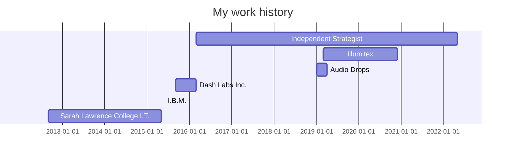

# Technical and UX Writing
## Elliot is a writer specializing in technical and UX writing ✍️

- [UX Writing](https://github.com/Elliot-KG/Technical_and_UX_Writing/edit/main/README.md#ux-writing-)
- [Technical Writing](https://github.com/Elliot-KG/Technical_and_UX_Writing/edit/main/README.md#technical-writing-)
- [Programming Background](https://github.com/Elliot-KG/Technical_and_UX_Writing/edit/main/README.md#programming-background)
- [Résumé](https://github.com/Elliot-KG/Technical_and_UX_Writing/edit/main/README.md#r%C3%A9sum%C3%A9)
- [Contact](https://github.com/Elliot-KG/Technical_and_UX_Writing/edit/main/README.md#contact)

----
### UX Writing 📱

----
### Technical Writing 💻
> "An API is only as useful as its documentation" — Me[^1]
[^1]: Elliot K. Goldman on March 18th, 2022

#### Selected work
[CSS Tricks – Comparing the Different Types of Native JavaScript Popups](Technical Writing/Comparing the Different Types of Native JavaScript Popups\ \|\ CSS-Tricks\ -\ CSS-Tricks.pdf)

----
### Programming Background ⚙️

```swift
// Written in Swift

///This method returns an array of programming languages that I have used at some point in my life
///- Warning: No localization data. Always returns in English.
///- Author: Elliot K. Goldman
///- Parameter void:
///- Returns: A tuple with two values
///    - `numOfYears`: The number of years I've been programming
///    - `languages`: The different languages I've used throughout the years
///- Todo: Learn what's next
///- Note:
/// # Example #
/// ```
/// print(experience.languages.dropLast().joined(separator: ", ")) // C, C++, Java, Javascript, Lua, Objective-C, Python, Swift
///print(experience.numOfYears) //12
/// ```
func programmingExperience() -> (numOfYears: Int, languages: [String]){
    
    let iHaveUsed = [
        "C", //It's been a while
        "C++",
        "Java",
        "Javascript",
        "Lua",
        "Objective-C", //Who still uses Objective-C!?
        "Python",
        "Swift"
    ]
    let numYears = 12 //Number of years programming
    return (numYears, iHaveUsed)
}
let experience = programmingExperience()
print("Elliot has \(experience.numOfYears) years programming experience using: \(experience.languages.dropLast().joined(separator: ", ")), and \(experience.languages.last!) at various times.")

```
```
Elliot has 12 years programming experience using: C, C++, Java, Javascript, Lua, Objective-C, Python, and Swift at various times.
```
----
### Résumé 📰



- #### Elliot K. Goldman (March 2016 - Present)
  *Independent Strategist*
	 - UX writing, technical writing, copywriting, design, and creative strategy

- #### Illumitex (March 2019 - December 2020)
  *UI/UX designer/developer [long-term contract]*
	 - UI/UX for award winning web app

- #### Audio Drops (January 2019 - April 2019)
  *iPhone Developer [long-term contract]*
	 - built social music app utilizing mobile phone AR 

- #### Dash Labs Inc. (September 2015 - March 2016)
  *Lead iOS Developer*

- #### I.B.M. (Summer 2015)
  *iOS Mobile Developer [Internship]*

- #### Sarah Lawrence College I.T.  (2012-2015)
  *Web Services Graphics Assistant*
	 - Documentation, technical writing, design, promotional materials

----
I also work on ✨[Copywriting and Creative Strategy](https://www.elliotkg.com/)✨


I've taught tech and various other things
- [SuperHi - Random Cursor Tutorial](https://youtu.be/BkpdwjppVVE)


### Contact 📧

[Get in touch!](mailto:ElliotKGoldman@gmail.com)

