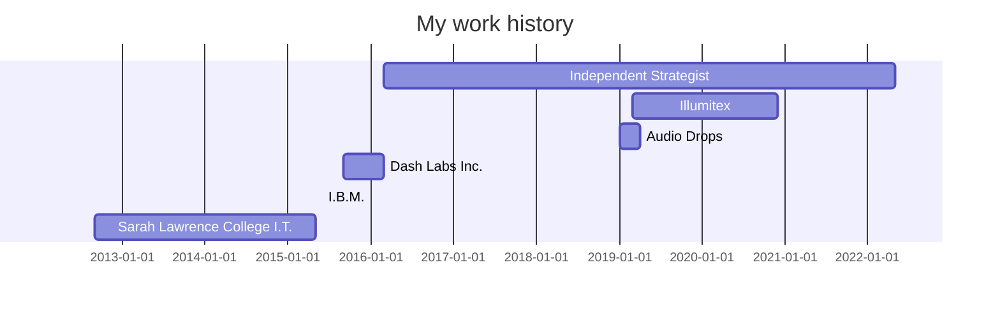

# Technical and UX Writing
## Elliot is a writer specializing in technical and UX writing ✍️

- [UX Writing](https://github.com/Elliot-KG/Technical_and_UX_Writing/edit/main/README.md#ux-writing-)
- [Technical Writing](https://github.com/Elliot-KG/Technical_and_UX_Writing/edit/main/README.md#technical-writing-)
- [Software](https://github.com/Elliot-KG/Technical_and_UX_Writing/edit/main/README.md#software-%EF%B8%8F)
- [Programming Background](https://github.com/Elliot-KG/Technical_and_UX_Writing/edit/main/README.md#programming-background-%EF%B8%8F)
- [Résumé](https://github.com/Elliot-KG/Technical_and_UX_Writing/edit/main/README.md#r%C3%A9sum%C3%A9-)
- [Honors & Awards](https://github.com/Elliot-KG/Technical_and_UX_Writing/edit/main/README.md#honors--awards-)
- [Teaching](https://github.com/Elliot-KG/Technical_and_UX_Writing/edit/main/README.md#teaching-)
- [What Else?](https://github.com/Elliot-KG/Technical_and_UX_Writing/edit/main/README.md#what-else-)
- [Contact](https://github.com/Elliot-KG/Technical_and_UX_Writing/edit/main/README.md#contact-)

🚩 Based in Providence, Rhode Island 🚩

----
### UX Writing 📱
> "Because 'Get in Touch,' 'Contact Us,' and 'Email Us ASAP' don't all mean the same thing" — Me[^1]
[^1]: Elliot K. Goldman on March 18th, 2022


[](UX%20Writing/Illumitex_mobileApp.png)
[](UX%20Writing/Illumitex_webApp.png)

----
### Technical Writing 💻
> "An API is only as useful as its documentation" — Me[^2]
[^2]: Elliot K. Goldman on March 18th, 2022


[](Technical%20Writing/Comparing%20the%20Different%20Types%20of%20Native%20JavaScript%20Popups.pdf)
[](Technical%20Writing/SLCWho_descriptions.png)
[](Technical%20Writing/HowMySLC.png)

### Software 🛠️
|  Adobe Creative Suite           |   Sketch   |  Figma |
|---------------------------------|------------|--------|
|__Microsoft/Google Office Suite__|__Markdown__|__Zoom__|

----
### Programming Background ⚙️

I have a past-life as a web and iOS developer. Documentation (or the lack thereof 🙃) is what led me to technical writing.

```swift
// Written in Swift

///This method returns an array of programming languages that I have used at some point in my life
///- Warning: No localization data. Always returns in English.
///- Author: Elliot K. Goldman
///- Parameter void:
///- Returns: A tuple with two values
///    - `numOfYears`: The number of years I've been programming
///    - `languages`: The different languages I've used throughout the years
///- Todo: Learn what's next
///- Note:
/// # Example #
/// ```
/// print(experience.languages.dropLast().joined(separator: ", ")) // C, C++, Java, Javascript, Lua, Objective-C, Python, Swift
///print(experience.numOfYears) //12
/// ```
func programmingExperience() -> (numOfYears: Int, languages: [String]){
    
    let iHaveUsed = [
        "C", //It's been a while
        "C++",
        "Java",
        "Javascript",
        "Lua",
        "Objective-C", //Who still uses Objective-C!?
        "Python",
        "Swift"
    ]
    let numYears = 12 //Number of years programming
    return (numYears, iHaveUsed)
}
let experience = programmingExperience()
print("Elliot has \(experience.numOfYears) years programming experience using at various times: \(experience.languages.dropLast().joined(separator: ", ")), and \(experience.languages.last!) all at various times.")

```
```
Elliot has 12 years programming experience using at various times: C, C++, Java, Javascript, Lua, Objective-C, Python, and Swift.
```
----
### Résumé 📰


- #### Elliot K. Goldman (March 2016 - Present)
  *Independent Strategist*
	 - Technical writing, UX writing, UI/UX design, copywriting, design, and creative strategy

- #### Illumitex (March 2019 - December 2020)
  *UI/UX designer/developer [long-term contract]*
	 - UI/UX for award winning web app

- #### Audio Drops (January 2019 - April 2019)
  *iPhone Developer [long-term contract]*
	 - built social music app utilizing mobile phone AR 

- #### Dash Labs Inc. (September 2015 - March 2016)
  *Lead iOS Developer*

- #### I.B.M. (Summer 2015)
  *iOS Mobile Developer [Internship]*

- #### Sarah Lawrence College I.T.  (2012-2015)
  *Web Services Graphics Assistant*
	 - Documentation, technical writing, design, promotional materials

⬇️📰 [pdf résumé](ElliotKGoldman_Resume_22.pdf) ⬇️📰 

----
### Honors & Awards 🥇
__Illumitex__
- UI/UX for a web app that received honorable mention in the Data Design category of Fast Company’s 2020 Innovation by Design Awards
- UI/UX for a web app that won Greenhouse Grower's "Technology of the Year"
- UI/UX for a web app featured in CropLife's best agriculture apps for 2021

----
### Teaching 🍎
I've taught tech and various other things
- [SuperHi – Random Cursor Tutorial](https://youtu.be/BkpdwjppVVE)
- [Index – Animation Tasting Menu](https://index-space.org/products/animation-overview)[^3]
- In-person development tutoring

[^3]:Sometimes I go by Elliot Keeler. Keeler is my middle name and my Great-Grandmother's maiden name.

----
### What Else? 🌻

I also work on ✨[Copywriting & Creative Strategy](https://www.elliotkg.com/)✨ as well as ◻️[Illustration & Design](https://dribbble.com/ElliotKG)◼️

While not writing I'm usually: 🌲🏃🧗🍵🧋🎨🥁🎹🎵🪡🧶🌲

### Contact 📧

📫 [Get in touch!](mailto:ElliotKGoldman@gmail.com)<br>
💼 [LinkedIn](https://www.linkedin.com/in/elliot-k-goldman/)<br>
🐦 [@HiElliotKeeler](https://twitter.com/hielliotkeeler)

